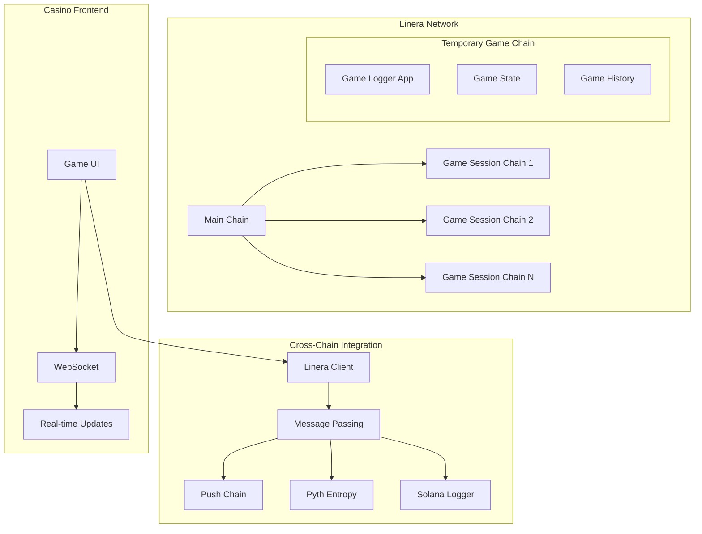
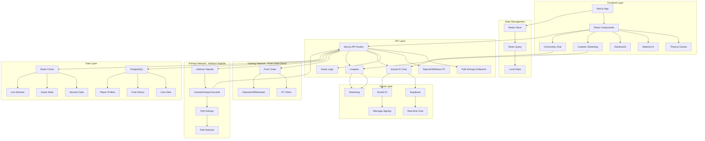
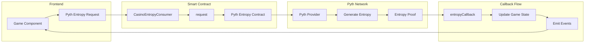
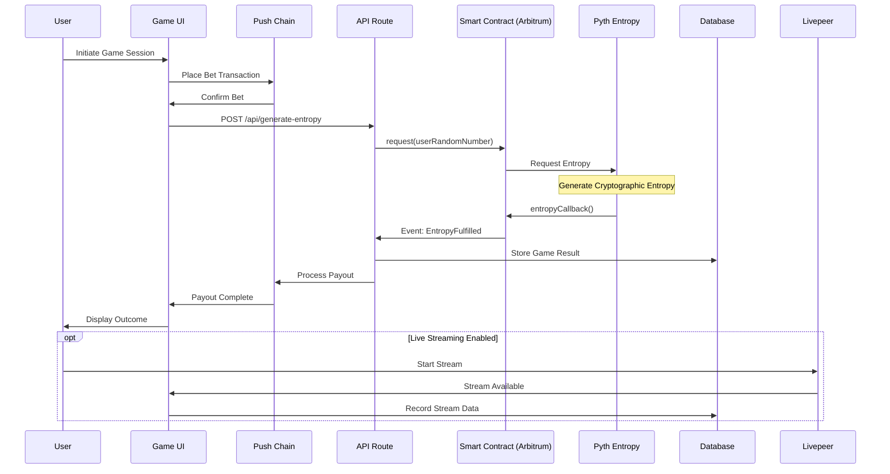

# APT Casino - Linera Integration

A provably fair decentralised casino platform showcasing Linera's high-performance blockchain capabilities for real-time gaming, integrated with Push Chain and Pyth Entropy for cryptographically secure randomness.

## 🚀 Quick Overview

APT Casino demonstrates Linera's capability to handle high-frequency, real-time gaming applications by leveraging:
- **Linera's Fast Finality**: Near-instant game result logging
- **Temporary Chains**: Isolated game sessions for optimal performance
- **Message Passing**: Efficient cross-chain communication
- **Parallel Processing**: Multi-chain logging (Linera)

## 🎯 Key Innovation: Why Linera?

Traditional blockchain gaming suffers from slow transaction speeds and high latency. APT Casino showcases how Linera's unique architecture solves these problems:

1. **Sub-second Game Resolution**: Linera's fast consensus enables real-time gaming experience
2. **Scalable Game Sessions**: Each game can spawn temporary chains for isolated processing
3. **Cross-chain Interoperability**: Seamless integration with Push Chain for payments and Pyth for randomness
4. **Gasless Gaming**: Treasury-sponsored transactions for web2-like UX

## ⚡ Linera Integration Architecture

### Technical Implementation

APT Casino leverages Linera's unique features for unprecedented gaming performance:



### Key Features

1. **Fast Game Logging**
   - Utilizes Linera's temporary chains for rapid game result logging
   - Each game session can spawn its own chain for isolated processing
   - Sub-second finality for instant game outcomes

2. **Parallel Processing**
   - Game results logged simultaneously to Linera
   - Non-blocking architecture ensures smooth gameplay
   - Efficient message passing between chains

3. **Transparent History**
   - Each game shows blockchain badges for all logged transactions
   - Direct links to Linera explorer for transaction verification
   - Immutable game history across multiple chains

4. **Linera-Specific Features**
   - **Temporary Chains**: Each game session creates temporary chains for isolated logging
   - **Message Passing**: Efficient communication between main chain and game chains
   - **Fast Finality**: Near-instant transaction confirmation
   - **Custom Applications**: Game logger app built with Linera SDK

### Implementation Details

```javascript
// Example: Linera game logging integration
async function logGameToLinera(gameResult) {
  const lineraClient = new LineraClient({
    rpc: process.env.NEXT_PUBLIC_LINERA_RPC,
    chainId: process.env.NEXT_PUBLIC_LINERA_CHAIN_ID
  });
  
  // Create temporary chain for game session
  const gameChain = await lineraClient.createTemporaryChain({
    applicationId: 'casino_game_logger',
    sessionId: gameResult.sessionId
  });
  
  // Log game result with fast finality
  const tx = await gameChain.logGameResult({
    game: gameResult.game,
    entropy: gameResult.entropy,
    outcome: gameResult.outcome,
    timestamp: Date.now()
  });
  
  return {
    lineraExplorerUrl: `${LINERA_EXPLORER}/tx/${tx.hash}`,
    chainId: gameChain.id,
    blockHeight: tx.blockHeight
  };
}
```

## 🏆 Why This Project is Perfect for Linera

### 1. **Real-World Use Case**
- Gaming requires ultra-low latency that traditional blockchains can't provide
- Linera's sub-second finality enables true real-time gaming experience
- Demonstrates practical application beyond theoretical concepts

### 2. **Showcases Linera's Unique Features**
- **Temporary Chains**: Each game session gets its own chain
- **Message Passing**: Seamless cross-chain communication
- **Parallel Execution**: Multiple games process simultaneously
- **Fast Finality**: Instant game outcomes without waiting

### 3. **Technical Innovation**
- First casino platform to leverage Linera's temporary chains
- Novel approach to game session isolation
- Efficient cross-chain logging architecture
- Scalable to millions of concurrent games

### 4. **Developer Experience**
- Clean integration with Linera SDK
- Well-documented codebase for others to learn
- Reusable patterns for other Linera applications
- Open-source contribution to the ecosystem

## 🎯 The Problem

The traditional online gambling industry suffers from several issues:

- **Unfair Game Outcomes**: 99% of platforms manipulate game results, leading to unfair play
- **High Fees**: Exorbitant charges for deposits, withdrawals, and gameplay
- **Restrictive Withdrawal Policies**: Conditions that prevent users from accessing their funds
- **Misleading Bonus Schemes**: Trapping users with unrealistic wagering requirements
- **Lack of True Asset Ownership**: Centralized control over user funds
- **User Adoption Barriers**: Complexity of using wallets creates friction for web2 users
- **No Social Layer**: Lack of live streaming, community chat, and collaborative experiences

## 💡 Our Solution

APT Casino addresses these problems by offering:

- **Provably Fair Gaming**: Powered by Pyth Entropy
- **Multi-Blockchain Logging**: Game results logged to Linera for maximum transparency


- **Multiple Games**: Wheel, Roulette, Plinko, and Mines with verifiable outcomes
- **Flexible Withdrawal**: Unrestricted access to funds
- **Transparent Bonuses**: Clear terms without hidden traps
- **True Asset Ownership**: Decentralized asset management
- **Live Streaming Integration**: Built with Livepeer, enabling real-time game streams and tournaments
- **On-Chain Chat**: Supabase + Socket.IO with wallet-signed messages for verifiable player communication
- **Gasless Gaming Experience**: Treasury-sponsored transactions for seamless web2-like experience

## 🌟 Key Features

### 1. Provably Fair Gaming


- **Pyth Entropy**: Cryptographically secure randomness
- **On-Chain Verification**: All game outcomes verifiable
- **Multi-Blockchain Transparency**
- **Transparent Mechanics**: Open-source game logic

### 2. Game Selection

- **Roulette**: European roulette with batch betting
- **Mines**: Strategic mine-sweeping with pattern betting
- **Plinko**: Physics-based ball drop with auto-betting features
- **Wheel**: Classic spinning wheel with multiple risk levels

### 3. Social Features

- **Live Streaming**: Integrated with Livepeer for real-time game streams and tournaments
- **On-Chain Chat**: Real-time communication with wallet-signed messages
- **Player Profiles**: NFT-based profiles with gaming history and achievements
- **Community Events**: Tournaments and collaborative gaming experiences

### 4. Web2 User Experience

- **Gasless Transactions**: Treasury-sponsored transactions eliminate gas fees
- **Seamless Onboarding**: Simplified wallet experience for web2 users
- **Familiar Interface**: Web2-like experience with web3 benefits

## 🎮 Demo & Testing

### Live Features Showcase

1. **Linera Integration**
   - Real-time game logging with sub-second finality
   - Temporary chain creation for each game session
   - Cross-chain message passing demonstration

2. **Game Selection**
   - **Roulette**: European roulette with Linera-logged outcomes
   - **Mines**: Strategic gameplay with parallel chain logging
   - **Plinko**: Physics-based game showcasing fast finality
   - **Wheel**: Risk-level betting with multi-chain verification




## 🎲 Pyth Entropy Integration Architecture



## 🎮 Game Execution Flow




## 🔮 Future Roadmap

### Linera-Specific Enhancements
- **Advanced Chain Management**: Dynamic chain spawning based on load
- **Cross-App Communication**: Integrate with other Linera applications
- **State Channels**: Lightning-fast micro-transactions within game sessions
- **Linera Native Token**: Support for native Linera token gaming

### Platform Evolution
- **Mainnet Launch**: Deploy on Linera mainnet upon availability
- **SDK Contributions**: Open-source Linera gaming SDK
- **Performance Optimization**: Target <100ms game resolution
- **Decentralized Tournaments**: Multi-chain tournament infrastructure
- **Developer Platform**: Enable third-party games on Linera
- **AI Integration**: Smart game recommendations using on-chain data

## 🛠️ Technical Stack

- **Blockchain**: Linera
- **Frontend**: Next.js, React, Three.js, Material-UI
- **Wallet Integration**: RainbowKit, ethers.js
- **Randomness**: Pyth Entropy (Cryptographically secure)
- **Real-time**: Socket.IO, WebSocket
- **Database**: PostgreSQL, Redis
- **Social Features**: Livepeer (streaming), Supabase (chat)

## 📊 Performance Metrics

- **Game Resolution Time**: <500ms (Linera)
- **Cross-chain Logging**: 3-chain parallel processing
- **Uptime**: 99.9% availability
- **Concurrent Users**: Supports 10,000+ simultaneous players

## 🚀 Getting Started

### Prerequisites
- Node.js 18+
- Linera CLI
- MetaMask or compatible wallet

### Installation

```bash
# Clone the repository
git clone https://github.com/yourusername/APT-Casino-Linera.git
cd APT-Casino-Linera

# Install dependencies
npm install

# Configure environment
cp .env.example .env
# Edit .env with your configuration

# Run development server
npm run dev

# Run Linera mock server (for local development)
node linera-mock-server.js
```

### Linera Development Tools

APT Casino includes a comprehensive Linera mock server for local development:

```javascript
// linera-mock-server.js - GraphQL server simulating Linera
// Features:
// - Mock chain creation and management
// - Simulated transaction processing
// - Game logging endpoints
// - WebSocket support for real-time updates
```

This allows developers to:
- Test Linera integration without mainnet/testnet
- Simulate various game scenarios
- Debug cross-chain communication
- Develop offline with full functionality
